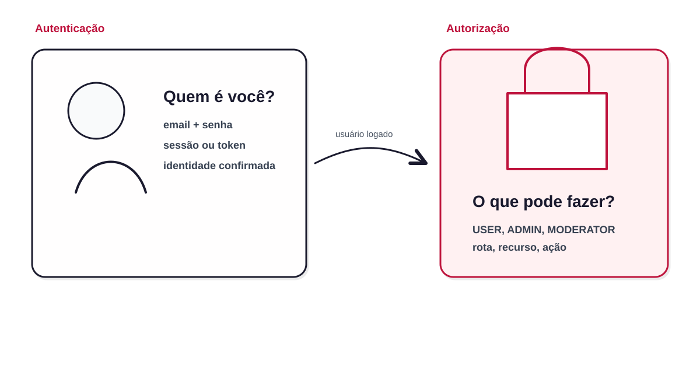
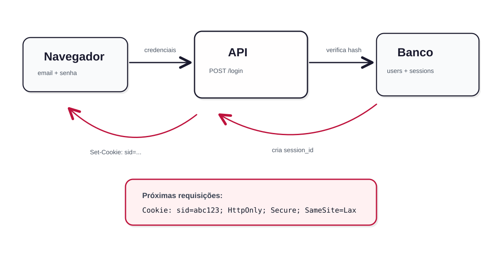
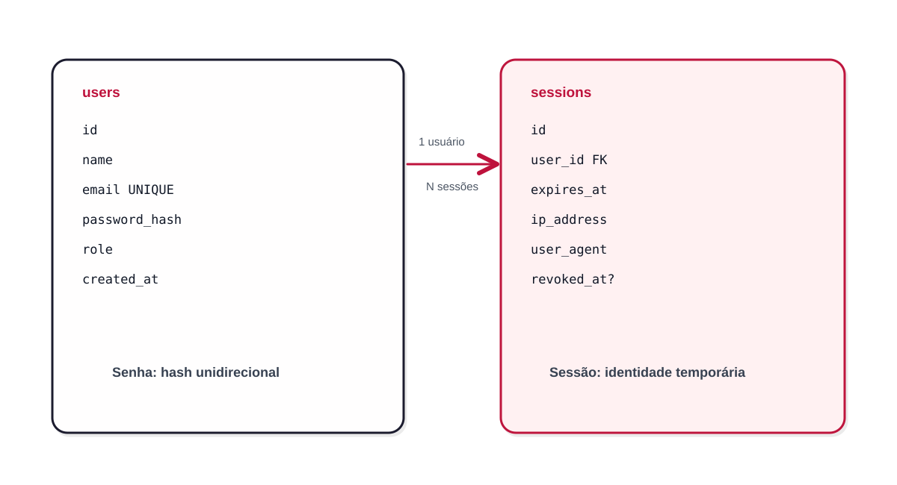
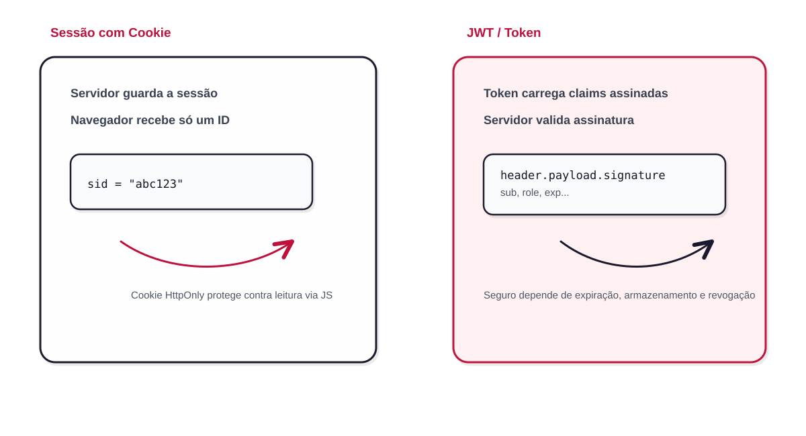
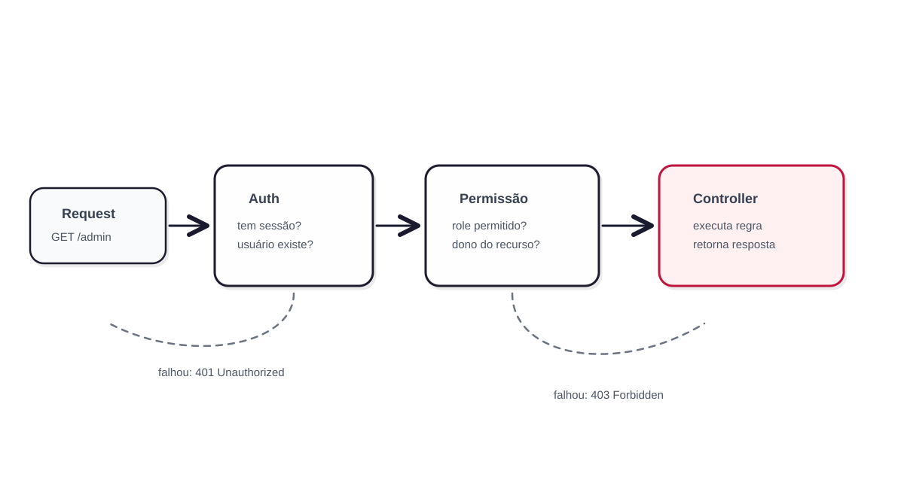
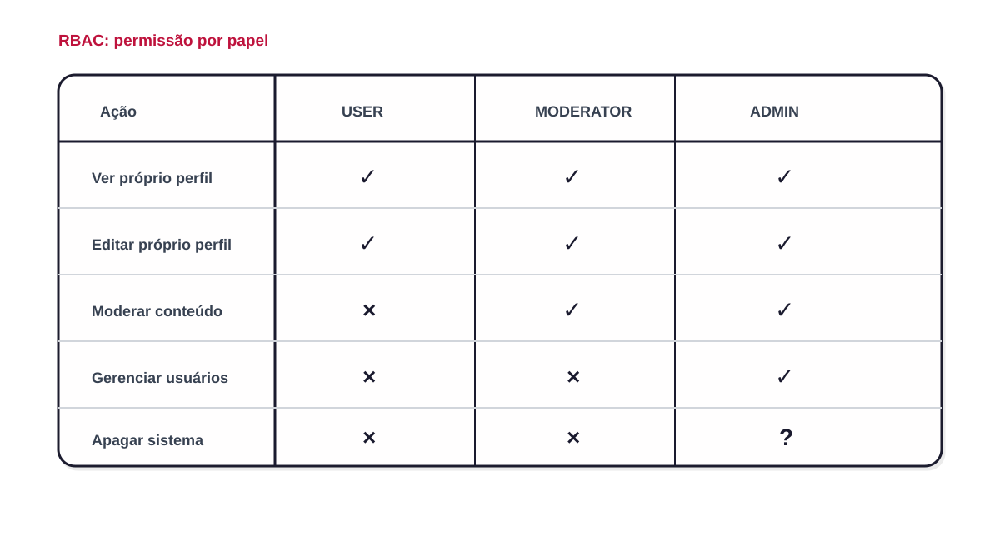

<!-- _class: cover -->

## Clube de Desenvolvimento Web — Semana 6

# Login, Sessão e Permissões

*Não basta ter API: agora ela precisa saber quem está usando.*

---

# Antes de começar: mostre o que construiu

A cultura do clube não é só assistir. É **construir, errar, mostrar e melhorar**.

### Show-and-tell da Semana 5

- Quem documentou uma API pública?
- Quem fez uma API REST com 3 recursos?
- Quem conseguiu usar Prisma + PostgreSQL via Docker?
- Alguém tentou GraphQL?

> Projeto pequeno entregue vale mais que projeto grande imaginado.

---

# Por que esse tema agora?

| Semana | O que já vimos | Conexão com login e permissões |
|---|---|---|
| **2** | Segurança | hash de senha, SQL Injection, boas práticas |
| **3** | Cookies, LocalStorage e Docker | onde guardar sessão/token e onde não guardar |
| **4** | Banco de Dados | tabela de usuários, credenciais, menor privilégio |
| **5** | APIs e ORMs | rotas REST, status HTTP, Prisma e validação |

> Agora vamos juntar tudo isso em um fluxo real: cadastro, login, sessão e autorização.

---

<!-- _class: center -->

# Uma API sem autenticação é uma porta aberta.

## Uma API protegida sabe:

**quem entrou**, **o que pode fazer** e **quando bloquear**.

---

# Agenda

1. **Autenticação vs autorização**
2. **Cadastro e hash de senha**
3. **Login e criação de sessão**
4. **Cookies, sessão e JWT**
5. **Middleware de autenticação**
6. **Permissões e papéis**
7. **Status HTTP corretos**
8. **Desafio da Semana 6**

---

<!-- _class: cover -->

## Parte 1

# Autenticação, autorização, sessão e permissão

---

# Quatro conceitos que muita gente mistura

| Conceito | Pergunta que responde | Exemplo |
|---|---|---|
| **Autenticação** | Quem é você? | email + senha |
| **Sessão** | Como lembrar que você já entrou? | cookie `sid` ou token |
| **Autorização** | O que você pode fazer? | pode acessar `/admin`? |
| **Permissão** | Qual regra permite ou bloqueia? | `USER`, `ADMIN`, dono do recurso |

> Login não é só comparar senha. Login cria uma identidade temporária para as próximas requisições.

---

# Autenticação vs autorização

<div class="diagram">



</div>

---

# Exemplo simples

```http
POST /login
Content-Type: application/json

{
  "email": "joao@email.com",
  "password": "minhasenha"
}
```

Se estiver correto:

```http
HTTP/1.1 200 OK
Set-Cookie: sid=abc123; HttpOnly; Secure; SameSite=Lax
```

Depois:

```http
GET /me
Cookie: sid=abc123
```

---

# Três rotas para entender tudo

| Rota | Precisa estar logado? | Precisa ser admin? | Objetivo |
|---|---:|---:|---|
| `POST /login` | Não | Não | Entrar no sistema |
| `GET /me` | Sim | Não | Ver usuário atual |
| `DELETE /users/:id` | Sim | Sim | Remover usuário |

> `GET /me` prova autenticação. `DELETE /users/:id` prova autorização.

---

<!-- _class: cover -->

## Parte 2

# Cadastro e senha segura

---

# O que acontece no cadastro?

```txt
Usuário envia: nome, email e senha
        ↓
API valida os dados
        ↓
API gera hash da senha
        ↓
Banco salva o usuário com password_hash
```

A senha original **não deve ser salva**.

O banco deve receber apenas algo como:

```txt
$argon2id$v=19$m=65536,t=3,p=4$...
```

---

# Por que não salvar senha pura?

```txt
Banco vazado:

email              senha
joao@email.com     minhasenha123
maria@email.com    cachorro2026
```

Se isso acontecer, o invasor não roubou só o banco.

Ele roubou também contas em outros serviços onde as pessoas reutilizaram a mesma senha.

> Senha de usuário é segredo. O sistema não deve conseguir ler esse segredo depois do cadastro.

---

# Hash não é criptografia reversível

| Técnica | Volta ao valor original? | Uso correto |
|---|---:|---|
| **Criptografia** | Sim, com chave | dados que precisam ser lidos depois |
| **Hash comum** | Não | integridade de arquivo |
| **Hash de senha** | Não | proteger senha contra vazamento |

Para senhas, use algoritmos próprios:

- `Argon2id`
- `bcrypt`
- `scrypt`

---

# Exemplo com Argon2

```ts
import argon2 from "argon2";

const passwordHash = await argon2.hash(password, {
  type: argon2.argon2id,
});

await prisma.user.create({
  data: {
    name,
    email,
    passwordHash,
    role: "USER",
  },
});
```

> A aplicação salva `passwordHash`, nunca `password`.

---

# Exemplo de modelagem com Prisma

```prisma
model User {
  id           String   @id @default(uuid())
  name         String
  email        String   @unique
  passwordHash String
  role         Role     @default(USER)
  createdAt    DateTime @default(now())
  sessions     Session[]
}

enum Role {
  USER
  MODERATOR
  ADMIN
}
```

---

# Erros comuns no cadastro

| Erro | Resposta adequada |
|---|---|
| Email inválido | `400 Bad Request` ou `422 Unprocessable Entity` |
| Senha fraca | `422 Unprocessable Entity` |
| Email já cadastrado | `409 Conflict` |
| Usuário criado | `201 Created` |

> Código HTTP também faz parte do contrato da API.

---

<!-- _class: cover -->

## Parte 3

# Login e sessão

---

# O que acontece no login?

```txt
Usuário envia email e senha
        ↓
API busca o usuário pelo email
        ↓
API compara a senha enviada com o hash salvo
        ↓
Se estiver correto: cria sessão ou token
        ↓
Cliente usa essa identidade nas próximas requisições
```

Login errado deve retornar **401 Unauthorized**.

---

# Fluxo de login com sessão em cookie

<div class="diagram">



</div>

---

# Comparando senha no login

```ts
const user = await prisma.user.findUnique({
  where: { email },
});

if (!user) {
  return reply.status(401).send({ message: "Credenciais inválidas" });
}

const passwordOk = await argon2.verify(user.passwordHash, password);

if (!passwordOk) {
  return reply.status(401).send({ message: "Credenciais inválidas" });
}
```

> Não diga se o email existe. A mensagem deve ser genérica.

---

# Por que a mensagem de erro deve ser genérica?

```txt
Ruim:
- "Email não encontrado"
- "Senha incorreta"

Melhor:
- "Credenciais inválidas"
```

Se a API diz que o email existe, ela ajuda alguém a enumerar usuários cadastrados.

> Segurança também está no detalhe da mensagem retornada.

---

# Sessão no banco

<div class="diagram">



</div>

---

# Exemplo de tabela de sessão

```prisma
model Session {
  id        String    @id @default(uuid())
  userId    String
  user      User      @relation(fields: [userId], references: [id])
  expiresAt DateTime
  ipAddress String?
  userAgent String?
  revokedAt DateTime?
  createdAt DateTime  @default(now())
}
```

Uma sessão pode expirar, ser revogada ou ser apagada no logout.

---

# Criando sessão após login

```ts
const session = await prisma.session.create({
  data: {
    userId: user.id,
    expiresAt: new Date(Date.now() + 1000 * 60 * 60 * 24 * 7),
    ipAddress: request.ip,
    userAgent: request.headers["user-agent"],
  },
});

reply.setCookie("sid", session.id, {
  httpOnly: true,
  secure: true,
  sameSite: "lax",
  path: "/",
  maxAge: 60 * 60 * 24 * 7,
});
```

---

# Flags importantes do cookie

| Flag | O que faz | Por que importa |
|---|---|---|
| `HttpOnly` | JS não consegue ler | reduz impacto de XSS |
| `Secure` | só envia em HTTPS | evita vazamento em HTTP |
| `SameSite` | controla envio cross-site | ajuda contra CSRF |
| `Max-Age` | define validade | evita sessão eterna |
| `Path` | limita rotas | reduz superfície de envio |

> Cookie de sessão sem `HttpOnly` é quase sempre sinal de problema.

---

<!-- _class: cover -->

## Parte 4

# Cookie, sessão e JWT

---

# Sessão com cookie vs JWT

<div class="diagram">



</div>

---

# Sessão com cookie

### Vantagens

- Fácil de revogar no servidor
- Bom para aplicações web tradicionais
- Pode usar `HttpOnly`, `Secure` e `SameSite`
- O cliente não precisa manipular token manualmente

### Pontos de atenção

- Precisa lidar com CSRF em alguns cenários
- Exige armazenamento de sessão no servidor
- Escala pode exigir Redis ou banco compartilhado

---

# JWT

### Vantagens

- Carrega informações assinadas: `sub`, `role`, `exp`
- Bom para APIs consumidas por diferentes clientes
- Não precisa consultar sessão em toda requisição, dependendo da estratégia

### Pontos de atenção

- Revogação é mais difícil
- Token vazado pode ser usado até expirar
- Armazenamento inseguro anula a vantagem

> JWT não é automaticamente mais seguro. Ele só muda o modelo.

---

# Onde guardar token?

| Local | Recomendação | Motivo |
|---|---|---|
| `localStorage` | Evitar para token sensível | qualquer JS da página consegue ler |
| `sessionStorage` | Também evitar para token sensível | ainda é acessível via JS |
| Cookie `HttpOnly` | Boa opção para web | JS não lê diretamente |
| Memória do app | útil em alguns SPAs | perde ao recarregar, exige refresh seguro |

> Preferências de tema podem ir no LocalStorage. Token de acesso precisa de mais cuidado.

---

# Sessão não é só login

Uma boa autenticação também precisa de:

- **Logout**: revogar ou apagar sessão
- **Expiração**: sessão não deve durar para sempre
- **Rotação**: trocar sessão após login sensível
- **Auditoria**: registrar acessos importantes
- **Rate limit**: limitar tentativas de login
- **Recuperação de senha**: fluxo próprio, com token temporário

---

<!-- _class: cover -->

## Parte 5

# Middleware de autenticação

---

# O que é middleware?

Middleware é uma função que roda **antes da rota final**.

```txt
Request
  ↓
Middleware de autenticação
  ↓
Middleware de permissão
  ↓
Controller da rota
  ↓
Response
```

Ele evita repetir a mesma validação em todas as rotas.

---

# Pipeline de uma rota protegida

<div class="diagram">



</div>

---

# Middleware de autenticação

```ts
async function requireAuth(request, reply) {
  const sessionId = request.cookies.sid;

  if (!sessionId) {
    return reply.status(401).send({ message: "Não autenticado" });
  }

  const session = await prisma.session.findUnique({
    where: { id: sessionId },
    include: { user: true },
  });

  if (!session || session.expiresAt < new Date() || session.revokedAt) {
    return reply.status(401).send({ message: "Sessão inválida" });
  }

  request.user = session.user;
}
```

---

# A rota `GET /me`

```ts
app.get("/me", { preHandler: [requireAuth] }, async (request) => {
  return {
    id: request.user.id,
    name: request.user.name,
    email: request.user.email,
    role: request.user.role,
  };
});
```

A rota não precisa saber como a sessão foi validada.

Ela apenas recebe `request.user` já resolvido pelo middleware.

---

# 401 vs 403

| Código | Quando usar | Exemplo |
|---|---|---|
| `401 Unauthorized` | usuário não autenticado | não enviou sessão/token |
| `403 Forbidden` | usuário autenticado, mas sem permissão | `USER` tentando acessar `/admin` |

```txt
401 = não sei quem você é
403 = sei quem você é, mas você não pode fazer isso
```

---

<!-- _class: cover -->

## Parte 6

# Permissões e papéis

---

# Permissão por papel: RBAC

**RBAC** significa **Role-Based Access Control**.

A ideia é simples:

```txt
Usuário tem um papel
        ↓
Papel libera ou bloqueia ações
        ↓
Rota decide se a ação pode continuar
```

Exemplos de papéis:

- `USER`
- `MODERATOR`
- `ADMIN`

---

# Matriz de permissões

<div class="diagram">



</div>

---

# Middleware de permissão por papel

```ts
function requireRole(...rolesAllowed) {
  return async function (request, reply) {
    if (!request.user) {
      return reply.status(401).send({ message: "Não autenticado" });
    }

    if (!rolesAllowed.includes(request.user.role)) {
      return reply.status(403).send({ message: "Sem permissão" });
    }
  };
}
```

Uso:

```ts
app.delete("/users/:id", {
  preHandler: [requireAuth, requireRole("ADMIN")],
}, deleteUserController);
```

---

# Nem tudo é só papel

Às vezes o usuário não é admin, mas é **dono do recurso**.

```txt
Usuário comum pode editar o próprio perfil.
Usuário comum não pode editar o perfil de outra pessoa.
Admin pode editar qualquer perfil.
```

Regra prática:

```txt
Pode fazer se:
- é ADMIN
ou
- é dono do recurso
```

---

# Exemplo: dono do recurso

```ts
app.patch("/users/:id", {
  preHandler: [requireAuth],
}, async (request, reply) => {
  const targetUserId = request.params.id;
  const currentUser = request.user;

  const isAdmin = currentUser.role === "ADMIN";
  const isOwner = currentUser.id === targetUserId;

  if (!isAdmin && !isOwner) {
    return reply.status(403).send({ message: "Sem permissão" });
  }

  // atualizar usuário...
});
```

---

# Permissão precisa estar no backend

```txt
Frontend esconde o botão "deletar usuário"
        ↓
Isso melhora a interface
        ↓
Mas não protege a API
```

O usuário pode chamar a rota diretamente com `curl`, Postman ou DevTools.

> Regra de permissão importante sempre fica no backend.

---

<!-- _class: cover -->

## Parte 7

# Boas práticas e erros comuns

---

# Checklist de login seguro

<div class="columns">

<div>

### Faça

- Salve senha com Argon2id ou bcrypt
- Use HTTPS em produção
- Use cookie `HttpOnly` para sessão web
- Expire sessões
- Faça rate limit no login
- Mensagens de erro genéricas
- Valide entrada com schema

</div>

<div>

### Evite

- Senha em texto puro
- Token sensível em LocalStorage
- Sessão sem expiração
- `ADMIN` definido pelo cliente
- Erro dizendo se email existe
- Backend confiando no frontend
- Segredos no código-fonte

</div>

</div>

---

# Erro clássico: mass assignment

```json
// Cliente deveria enviar apenas:
{
  "name": "João"
}

// Mas envia também:
{
  "name": "João",
  "role": "ADMIN"
}
```

Se a API aceitar tudo automaticamente, o usuário pode virar admin.

---

# Como evitar mass assignment

```ts
const updateUserSchema = z.object({
  name: z.string().min(2).optional(),
  email: z.string().email().optional(),
});

const data = updateUserSchema.parse(request.body);

await prisma.user.update({
  where: { id: request.user.id },
  data,
});
```

> A API deve aceitar apenas os campos permitidos. Nunca confie no corpo inteiro da requisição.

---

# Status HTTP no fluxo de login

| Situação | Status |
|---|---:|
| Cadastro criado | `201 Created` |
| Payload inválido | `400 Bad Request` |
| Validação semântica falhou | `422 Unprocessable Entity` |
| Email já existe | `409 Conflict` |
| Login correto | `200 OK` |
| Credenciais inválidas | `401 Unauthorized` |
| Logado sem permissão | `403 Forbidden` |
| Sessão encerrada | `204 No Content` |

---

# Como pensar segurança em camadas

```txt
Validação de entrada
        ↓
Hash de senha
        ↓
Sessão segura
        ↓
Middleware de autenticação
        ↓
Middleware de permissão
        ↓
Logs e auditoria
```

Não existe uma única técnica que resolve tudo.

Segurança é acúmulo de boas decisões pequenas.

---

<!-- _class: cover -->

## Parte 8

# Miniarquitetura da Semana 6

---

# Rotas mínimas do projeto

| Método | Rota | Protegida? | Objetivo |
|---|---|---:|---|
| `POST` | `/users` | Não | cadastrar usuário |
| `POST` | `/login` | Não | criar sessão |
| `POST` | `/logout` | Sim | encerrar sessão |
| `GET` | `/me` | Sim | retornar usuário logado |
| `GET` | `/users` | Sim, admin | listar usuários |
| `DELETE` | `/users/:id` | Sim, admin | remover usuário |

---

# Ordem recomendada de implementação

1. Criar model `User`
2. Criar model `Session`
3. Implementar `POST /users`
4. Implementar `POST /login`
5. Criar middleware `requireAuth`
6. Implementar `GET /me`
7. Criar middleware `requireRole`
8. Proteger rotas administrativas
9. Implementar `POST /logout`
10. Adicionar testes básicos

---

# Testes mínimos

```txt
Cadastro
- cria usuário com dados válidos
- bloqueia email duplicado
- não retorna passwordHash

Login
- autentica com senha correta
- rejeita senha errada
- cria cookie de sessão

Rotas protegidas
- GET /me sem sessão retorna 401
- USER acessando /admin retorna 403
- ADMIN acessando /admin retorna 200
```

---

<!-- _class: cover -->

## Recapitulando

# O que vimos hoje

---

# Resumo

<div class="columns">

**Autenticação**
- Responde quem é o usuário
- Normalmente começa em `POST /login`
- Compara senha enviada com hash salvo
- Cria uma sessão ou token

**Sessão**
- Mantém o usuário identificado
- Pode usar cookie `HttpOnly`
- Deve expirar e ser revogável
- Logout encerra a sessão

</div>

---

# Resumo continuação

<div class="columns">

**Autorização**
- Define o que o usuário pode fazer
- Usa papéis, permissões e dono do recurso
- Bloqueia com `403 Forbidden`
- Precisa estar no backend

**Boas práticas**
- Senha com Argon2id ou bcrypt
- Token sensível fora do LocalStorage
- Erros genéricos no login
- Rate limit e auditoria

</div>

---

# Desafio da Semana 6

### Nível iniciante

Crie uma tela simples de login fake em HTML, CSS e JavaScript. Ao clicar em entrar, salve apenas o nome do usuário no `sessionStorage` e exiba `Olá, nome`. Não precisa backend.

### Nível intermediário

Adicione autenticação à API da Semana 5 com `POST /users`, `POST /login`, senha com Argon2 ou bcrypt, rota protegida `GET /me` e middleware que retorna `401` quando não houver sessão válida.

### Nível avançado

Implemente autenticação completa com Prisma + PostgreSQL, sessão em cookie `HttpOnly`, papéis `USER` e `ADMIN`, rota admin protegida, logout, rate limit no login e testes básicos.

---

<!-- _class: cover -->

## Clube de Desenvolvimento Web — Semana 6

# Login não é só uma tela

*É o ponto onde identidade, segurança, banco, API e regra de negócio se encontram.*
